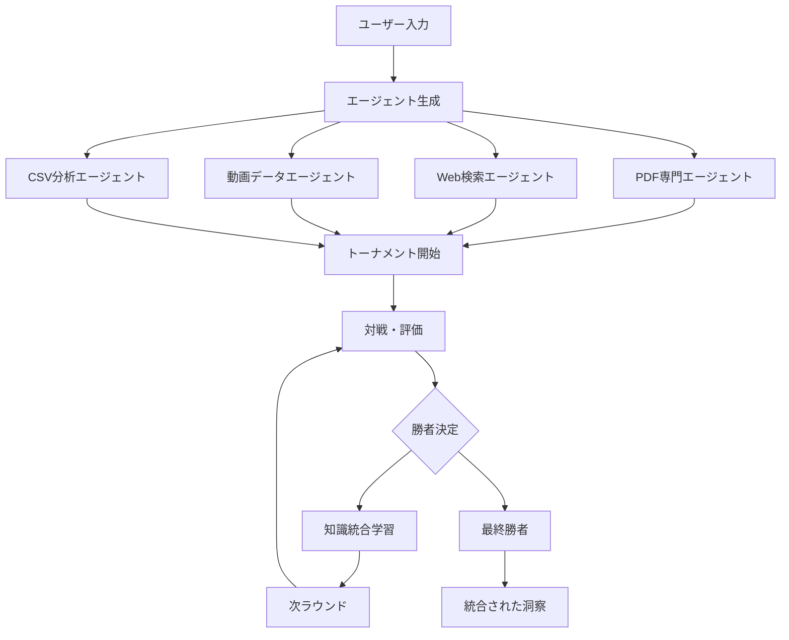

# 🏆 知識蒸留AIシステム - マルチソース統合学習プラットフォーム

## 📋 概要

本システムは、**単一のデータソースしかアクセスできない複数のLLMエージェント**が、トーナメント形式で競い合いながら知識を統合し、より深い洞察を生み出す革新的なAIプラットフォームです。

### 🎯 コアコンセプト

```
複数のデータソース × 制約付きエージェント × トーナメント学習 = 統合的洞察
```

各LLMエージェントは**1つのデータソースのみ**にアクセス可能という制約の下で、トーナメントを通じて他のエージェントから異なるデータソースの知見を学習し、最終的に全データソースの知識を統合した高品質な分析を実現します。

## 🚀 主要機能

### 1. マルチデータソース対応
- **📄 PDF文書**: 政策文書、レポート、マニフェストなどの構造化文書
- **🔍 Web検索**: 最新ニュース、専門家分析、メディア報道（Tavily API使用）
- **📹 動画データ**: YouTube/TikTokの動画メタデータと視聴統計
- **📊 CSVデータ**: X(Twitter)投稿データとエンゲージメント分析

### 2. トーナメント学習システム
- **シングルエリミネーション方式**: 敗者から勝者への知識転移
- **クロスソース学習**: 異なるデータソース間での知見統合
- **詳細スコアリング**: 多面的な評価基準による応答品質測定
- **学習履歴管理**: 知識統合プロセスの完全な追跡

### 3. 高度な分析機能
- **センチメント分析**: SNS投稿の感情分析
- **インフルエンサー特定**: 影響力のあるアカウントの検出
- **時系列トレンド分析**: データの時間的変化の追跡
- **リスクパターン認識**: 潜在的な評判リスクの早期発見

## 📦 インストール

### 必要要件
- Python 3.8以上
- 4GB以上のRAM推奨

### セットアップ手順

```bash
# 1. リポジトリのクローン
git clone https://github.com/your-repo/knowledge-distillation-system.git
cd knowledge-distillation-system

# 2. 仮想環境の作成
python -m venv venv
source venv/bin/activate  # Windows: venv\Scripts\activate

# 3. 依存関係のインストール
pip install -r requirements.txt

# 4. 環境変数の設定
cp .env.example .env
# .envファイルを編集してAPIキーを設定
```

### 環境変数設定

`.env`ファイルに以下のAPIキーを設定：

```env
# LLM APIs
OPENAI_API_KEY=your_openai_api_key
ANTHROPIC_API_KEY=your_anthropic_api_key  # オプション
GEMINI_API_KEY=your_gemini_api_key  # オプション

# Web Search
TAVILY_API_KEY=your_tavily_api_key

# その他
OPENROUTER_API_KEY=your_openrouter_key  # オプション
```

## 🎮 使用方法

### サーバーの起動

```bash
cd backend
python api_server.py
```

サーバーは `http://localhost:8000` で起動します。

### API ドキュメント

対話型APIドキュメント: `http://localhost:8000/docs`

### 基本的な使用例

#### トーナメントモード（複数エージェント）

```python
import requests

# 複数エージェントによるトーナメント実行
response = requests.post(
    "http://localhost:8000/api/generate",
    json={
        "title": "株式会社Luupの評判改善戦略について",
        "body": "電動キックボードサービスに対する批判をどう改善すべきか",
        "num_candidates": 12,  # 12エージェント生成
        "enable_learning": True,  # クロスソース学習を有効化
        "pdf_references": ["path/to/report.pdf"],
        "enable_web_search": True
    }
)

result = response.json()
print(f"最終スコア: {result['persuasion_score']}")
print(f"統合された分析: {result['response']}")
```

#### シングルモード（単一データソース）

```python
# 特定のデータソースのみを使用
response = requests.post(
    "http://localhost:8000/api/generate",
    json={
        "title": "最新のSNS動向分析",
        "body": "Twitter上での企業評判を分析",
        "use_single_model": True,
        "force_data_source": "csv"  # CSVデータのみ使用
    }
)
```

## 🏗️ システムアーキテクチャ



## 🔧 高度な設定

### トーナメント設定のカスタマイズ

```python
from api_server import TournamentConfig

config = TournamentConfig(
    agents_per_source=10,  # データソースごとのエージェント数
    learning_enabled=True,  # 学習機能の有効化
    parallel_processing=True,  # 並列処理
    max_retries=3,  # リトライ回数
    cache_enabled=True  # キャッシュ機能
)
```

### スコアリング重み付けの調整

```python
config.score_weights = {
    'base': 1.0,  # 基本品質
    'integration': 2.0,  # 知識統合度
    'learning': 0.5,  # 学習効果
    'depth': 1.5  # 分析の深さ
}
```

## 📊 評価メトリクス

システムは以下の観点から応答を評価：

| メトリクス | 説明 | 重み |
|-----------|------|------|
| **データ豊富性** | 具体的データの引用量 | 0.8 |
| **ソースカバレッジ** | 複数データソースの統合度 | 2.5 |
| **知識統合** | 異なる視点の融合品質 | 2.0 |
| **実用性** | 提案の具体性と実行可能性 | 2.0 |
| **リスク認識** | 潜在的問題の理解度 | 2.5 |

## 🎯 ユースケース

### 1. 企業評判分析
- SNS上の評判モニタリング
- 炎上リスクの早期発見
- PR戦略の最適化

### 2. 政策分析
- 複数の政策文書の統合分析
- メディア報道との相関分析
- 世論動向の把握

### 3. マーケット調査
- 競合分析
- 消費者インサイトの発見
- トレンド予測

## 🔬 技術的特徴

- **非同期処理**: FastAPIによる高速レスポンス
- **並列エージェント生成**: ThreadPoolExecutorによる効率化
- **メモリ最適化**: 学習履歴の圧縮機能
- **エラーハンドリング**: 自動リトライとフォールバック
- **キャッシュシステム**: 頻繁なパターンの再利用

## 📈 パフォーマンス

| 指標 | 値 |
|------|-----|
| 平均応答時間 | 15-30秒 |
| 並列処理エージェント数 | 最大10 |
| キャッシュヒット率 | 約40-60% |
| メモリ使用量 | 1-2GB |

## 🤝 コントリビューション

プルリクエストを歓迎します！大きな変更の場合は、まずissueを開いて変更内容を議論してください。

## 📄 ライセンス

[MIT License](LICENSE)

## 🙏 謝辞

本システムは以下の技術を活用しています：
- OpenAI GPT-4
- Tavily Search API
- FastAPI
- pdfplumber
- pandas

## 📮 お問い合わせ

- Issue: [GitHub Issues](https://github.com/your-repo/issues)
- Email: contact@example.com

---

*「知識の断片を統合し、洞察の深淵へ」* - Knowledge Distillation System v4.0